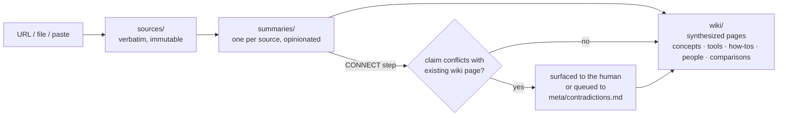

# AI Knowledge Wiki

[](https://github.com/tim-kaa-py/ai-wiki/actions/workflows/checks.yml)

An **LLM-maintained knowledge wiki about AI**, built on [Andrej Karpathy's LLM-wiki pattern](wiki/concepts/llm-wiki-pattern.md) and conformant to the [Open Knowledge Format (OKF) v0.1](https://github.com/GoogleCloudPlatform/knowledge-catalog/blob/main/okf/SPEC.md). A Claude Code agent does all the bookkeeping — extraction, summarization, cross-linking, index maintenance, contradiction management. The human curates sources and thinks critically.

Currently: **~80 sources → ~80 summaries → 80+ synthesized wiki pages**, all kept consistent by an agent-enforced operating contract.

## How it works



Every ingest runs a pipeline defined in [`CLAUDE.md`](CLAUDE.md): metadata extraction → transcript/content capture → focused summarization → **CONNECT** (merge into wiki pages, detecting contradictions before merging) → index + log. Analytical steps are routed to Opus sub-agents; mechanical steps stay on Sonnet.

## What's worth a look

- **Contradictions are never silently merged.** When a new source conflicts with an existing wiki claim, the agent must quote both claims verbatim and let the human decide (accept / keep / hold both / synthesize / defer). Deferred tensions live in an append-only ledger, [`meta/contradictions.md`](meta/contradictions.md). This is the wiki's defence against its main failure mode: confidently-written pages that quietly dropped a prior claim.
- **A multi-agent adversarial triage pipeline** (detector → verify → advocate/harmonizer → judge → challenger) retroactively scans wiki pages for contradictions, calibrated by [`meta/tension-policy.md`](meta/tension-policy.md) and rolled out pilot → shadow → autonomous with run reports in [`meta/triage-runs/`](meta/triage-runs/).
- **A confidentiality scan gates every non-public source and every generated summary** before it lands in this public repo (see "Step 0" in [`CLAUDE.md`](CLAUDE.md)).
- **The system documents itself.** A Self-Documentation Rule in the operating contract forces every functional change to sync [`docs/user-documentation.md`](docs/user-documentation.md) (for the human) and [`docs/concept.md`](docs/concept.md) (a self-contained guide for another agent to recreate the whole system on any topic).
- **Design process is in the open:** specs and implementation plans for the OKF migration and the tension-triage pipeline are under [`docs/superpowers/`](docs/superpowers/), and [`scripts/`](scripts/) ships with unit tests and a CI-run conformance checker.

## Start here

| Entry point | What it is |
|-------------|------------|
| [`index.md`](index.md) | Master index of all sources and wiki pages, grouped by pillar |
| [`wiki/`](wiki/) | The synthesized knowledge — concepts, tools, how-tos, people, comparisons |
| [`CLAUDE.md`](CLAUDE.md) | The agent's operating contract (workflows, schemas, guardrails) |
| [`docs/user-documentation.md`](docs/user-documentation.md) | How a human uses the system day-to-day |
| [`docs/concept.md`](docs/concept.md) | How to recreate this system from scratch, on any topic |
| [`log.md`](log.md) | Chronological record of every ingest, lint, and structural change |
| [`gists/`](gists/) | Reusable Claude Code prompts, shareable standalone |

## Repository layout

```
sources/     raw, verbatim captures (youtube, articles, papers, podcasts, repos, docs)
summaries/   one opinionated summary per source
wiki/        synthesized pages, maintained over time
notes/       per-source ingest notes (user focus + confirmed discoveries)
meta/        contradiction ledger, tension policy, triage-run reports
gists/       user-authored, reusable Claude Code prompts
scripts/     transcript extraction, local Whisper fallback, OKF conformance check (+ tests)
docs/        user documentation, recreation guide, design specs & plans
```

## License

Content (sources¹, summaries, wiki pages, docs) is licensed under [CC BY 4.0](LICENSE). The code in [`scripts/`](scripts/) is licensed under [MIT](scripts/LICENSE).

¹ Source files contain verbatim excerpts/transcripts of third-party material, captured for personal knowledge management; rights remain with the original creators, linked in each file's frontmatter.
